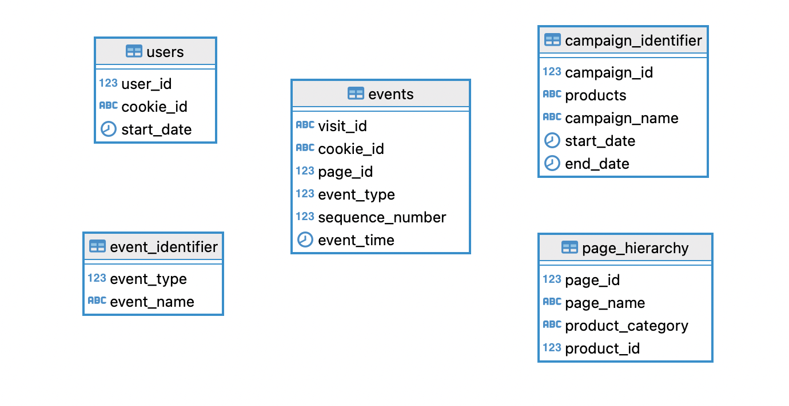

# E-commerce-Funnel-Insights-PostgreSQL

This project explores customer journey and purchasing behavior on an online seafood store using SQL. By querying a structured PostgreSQL database of user activity events, I aimed to uncover drop-off points in the sales funnel, identify best-performing products, and evaluate shopping behavior by product category.

## 💻 Tools

PostgreSQL (pgAdmin 4) via Docker using aggregation pipeline.

## About data

The database consists of the following tables:

- **page_hierarchy**: Contains the 9 product pages on the website, including *Salmon, Kingfish, Tuna, Russian Caviar, Black Truffle, Abalone, Lobster, Crab,* and *Oyster*. Each product is assigned a `product_id` from 1 to 9 and belongs to one of three categories: *Fish, Luxury,* or *Shellfish*.
- **users**: Tracks website visitors using browser cookies. Each user is identified by a unique `cookie_id`, which is either created or read upon each visit.
- **event_identifier**: Stores metadata about user interactions, with `event_type` and `event_name` fields covering events such as *Page View, Add to Cart, Purchase, Ad Impression,* and *Ad Click*.
- **campaign_identifier**: Contains information about three marketing campaigns run on the website.
- **events**: Captures all user activity. For each session (`cookie_id`), this table logs which page was visited (`page_id`), what event occurred (`event_type`), the timestamp of the event (`event_time`), and the `sequence_number` indicating the order of actions taken during the session.

## 💡 Business Insights

- **Strong Purchase Conversion**: Approximately 49.86% of all visits resulted in a purchase — a relatively high overall conversion rate, indicating effective product engagement and user intent.

- **Funnel Efficiency**:
  
  - 61% of users who viewed a product proceeded to add it to the cart.
  - 76% of those who added items to the cart went on to complete the purchase.
  - However, there was still a 15.5% drop-off at the checkout step, highlighting potential UX or pricing-related friction during the final decision phase.

- **Highest Cart Abandonment**: *Russian Caviar*, a luxury product, had the highest abandonment rate — frequently added to carts but rarely purchased. This insight suggests potential barriers such as pricing, perceived value, or lack of urgency messaging on the product page.
- **Highest View-to-Purchase Rate**: *Lobster* recorded the highest conversion rate from views to purchases at 48.74%, indicating strong buyer intent and product-market fit for this Shellfish item.
- **Best-Selling Products**: The top three products by purchase volume were *Lobster, Oyster,* and *Crab* — all from the **Shellfish** category — highlighting strong consumer preference for mid-range, high-value seafood.

## 📌 Coming Soon: Tableau Dashboard

An interactive Tableau dashboard is in development to visualize the customer funnel, product performance, and category-level insights for clearer business storytelling. Stay tuned!
